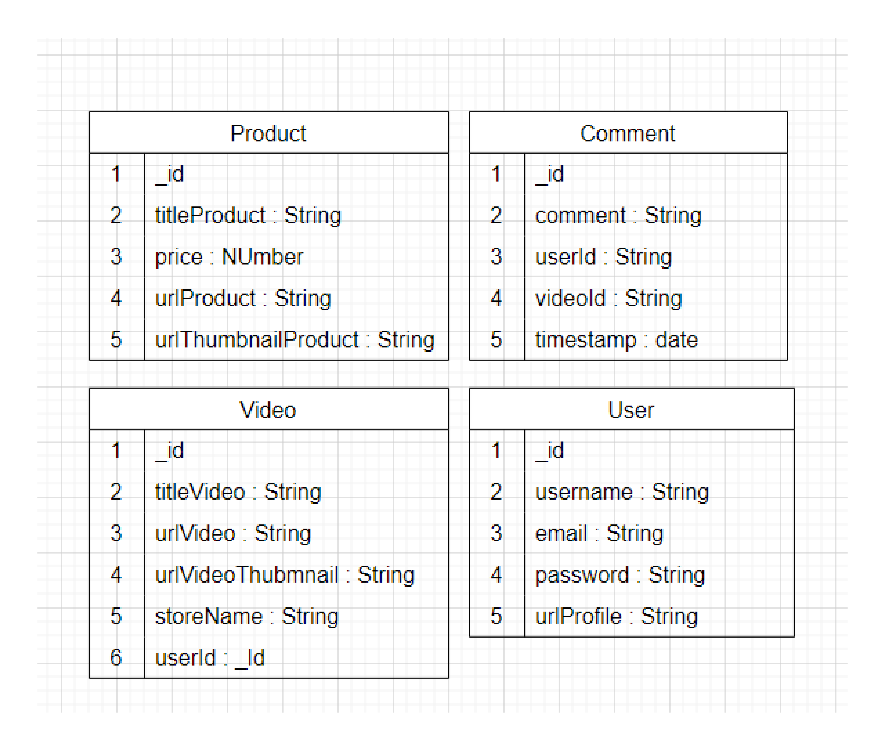
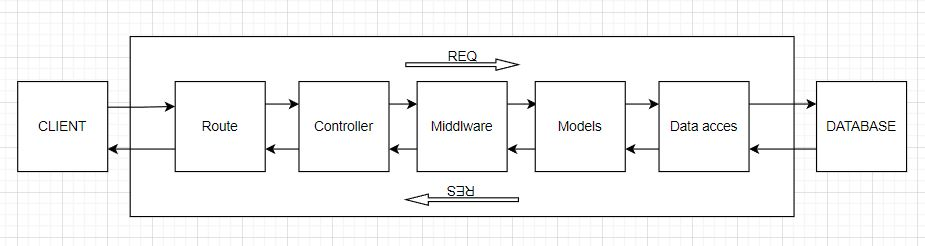

## This is Final term from GIGIH 3.0 Fullstack Developer 2023

##### [!IMPORTANT] : this README.md only for Server/Backend !!!.

### About this project :

This project about tokopedia play clone, this is final term from GIGIH 3.0
in this project build with MERN stack : (' Mongoodb, Express, ReactJs and NodeJS ')

And I try custom :

- UI Design
- User Flow
- Css I use Tailwindcss
- Icon use React-Icons
- JWT

you can site this website for complate :
[Flow Pages](https://www.figma.com/file/AuJFeq5AfpTb3uKFumY4ic/Final-Project-GIGIH-3.0?type=whiteboard&node-id=0%3A1&t=T2oQsInzIN29FhPF-1/).

### Fitures in this project :

- Login (with JWT Token)
- Register (bcrypt password)
- Get All Video
- Create Video by userId
- Get All Product by videoId
- Create Product by videoId
- Create Comment by userId
- Get Comment by videoId and get user data
- Search by Title Video
- Show profile Picture and Username on Navbar
- Realtime comment with socket.io


##### [!NOTE] : first you can clone this project :

```bash
git clone ( Https / SSH or Github CLI - link)
```

##### [!NOTE] : to download the latest version of npm, on the command line, run the following command:

```bash
npm install -g npm
```

##### [!NOTE] : to install this project depedencies, run the following command:

```bash
npm install
```

### 1. Database Structure :

##### [!NOTE] : to create **Database** in MONGOSH with name database is : finalProject.

Database have **4 collection** it's :

- user
- videos
- product
- comments

Example user Modal database :

```json
{
  urlPicture: {
    type: String,
    required: true,
  },
  username: {
    type: String,
    required: true,
  },
  email: {
    type: String,
    required: true,
  },
  password: {
    type: String,
    required: true,
  },
}
```

Example product database :

```json
{
  titleProduct: {
    type: String,
    required: true,
  },
  Price: {
    type: String,
    required: true,
  },
  urlProduct: {
    type: String,
    required: true,
  },
  urlThumbnailProduct: {
    type: String,
    required: true,
  },
  videoId: {
    type: mongoose.Schema.Types.ObjectId,
    ref: "videos",
    required: false,
  },
}
```

Example comment database :

```json
{
    comment : {
      type: String,
      required: true,
    },
    videoId: {
      type: mongoose.Schema.Types.ObjectId,
      ref: "videos",
      required: false,
    },
    userId: {
      type: mongoose.Schema.Types.ObjectId,
      ref: "users",
      required: false,
    },
  },
  {
    timestamps: true,
  }
```

Example video database :

```json
{
  storeName: {
    type: String,
    required: true,
  },
  urlVideo: {
    type: String,
    required: true,
  },
  titleVideo: {
    type: String,
    required: true,
  },
  urlVideoThumbnail: {
    type: String,
    required: true,
  },
  userId: {
    type: mongoose.Schema.Types.ObjectId,
    ref: "users",
    required: false,
  },
}
```

##### Database Structure Design :



### 2. API Structure

| METHOD | ROUTE            | FUNCTIONALITY                | ACCESS      |
| ------ | ---------------- | ---------------------------- | ----------- |
| _POST_ | `/user/register` | _Register User_              | _All users_ |
| _POST_ | `/user/login`    | _Login User_                 | _All users_ |
| _GET_  | `/user/:id`      | _Get one User_               | _All users_ |
| _GET_  | `/videos/:id`    | _Get a video by video id_    | _All users_ |
| _GET_  | `/videos/search` | _Search video by titleVideo_ | _All users_ |
| _GET_  | `/videos`        | _Gets a all videos_          | _All users_ |
| _POST_ | `/videos/:id`    | _Create video by userId_     | _All users_ |
| _GET_  | `/product/:id`   | _Get a product by video id_  | _All users_ |
| _POST_ | `/product/:id`   | _Post a product by video id_ | _All users_ |
| _GET_  | `/comment/:id`   | _Get a comment by video id_  | _All users_ |
| _POST_ | `/comment/:id`   | _Post a comment by video id_ | _All users_ |

##### API Structure Design :



### 3. List API request and response

#### POST /user/login

##### user must login for access

- URL Params : _None_
- Headers : _Content-Type: application/json._
- Data params :

```json
  {
    email      : string,
    password   : string
  }
```

- _Succes Response_ :

```json
{
  "message": "Login successful"
}
```

- Code : 201

- _Error Response_ :

```json
{
  "message": "Invalid email or password"
}
```

- Code : 401

#### POST /user/register

##### user must register for access

- URL Params : _None_
- Headers : _Content-Type: application/json._
- Data params :

```json
  {
    username   : string,
    email      : string,
    password   : string,
    urlPicture : string,
  }
```

- _Succes Response_ :

```json
{
  "message": "Register user Success !"
}
```

- Code 201

- _Error Response_ :

```json
{
  "message": "User data not valid"
}
```

- Code : 400

#### GET /videos

##### Return all video list

- URL Params : _None_
- Headers :
  _Content-Type : application/json. &_
  _Authorization : Bearer <OAuth Token>_
- Data params : _None_

- Succes Response :
- Code : 200
  Content :

  ```json
  {
    storeName         : String,
    urlVideo          : String,
    titleVideo        : String,
    urlVideoThumbnail : String,
    userId            : objectId,
  }
  ```

- Code : 200

- _Error Response_ :

```json
{
  "message": "Videos is Empty"
}
```

- Code : 400

#### POST /video:id

##### created video by userId logined

- URL Params : _None_
- Headers : _Content-Type: application/json._ & _Authorization : Bearer <OAuth Token>_
- Data params :

```json
  {
    storeName         : string,
    urlVideo          : string,
    titleVideo        : string,
    urlVideoThumbnail : string,
    userId            : objectId,
  }
```

- _Succes Response_ :

```json
{
  "message": "Succes Create Video"
}
```

- Code 201

- _Error Response_ :

```json
{
  "message": "Failed to create video"
}
```

- Code : 400

#### GET /videos:id

##### Get one video for detail video must logined

- URL Params : videoId
- Headers : _Content-Type: application/json._ & _Authorization : Bearer <OAuth Token>_
- Data params :

```json
  {
    storeName         : string,
    urlVideo          : string,
    titleVideo        : string,
    urlVideoThumbnail : string,
    userId            : objectId,
  }
```

- _Succes Response_ :

```json
{
  "message": "Success Get One Video"
}
```

- Code 201

- _Error Response_ :

```json
{
  "message": "Video not found"
}
```

- Code : 404

#### GET /videos

##### Search video by titleVideo

- URL Params : _None_
- Headers :
  _Content-Type : application/json. &_
  _Authorization : Bearer <OAuth Token>_
- Data params : Query

- Succes Response :
- Code : 200
  Content :

  ```json
  {
    storeName         : String,
    urlVideo          : String,
    titleVideo        : String,
    urlVideoThumbnail : String,
    userId            : objectId,
  }
  ```

- Code : 200

- _Error Response_ :

```json
{
  "message": "Videos is Empty"
}
```

- Code : 400

#### GET /product:id

##### Get product with videoId ( product display if only same with videoId in product data )

- URL Params : videoId
- Headers : _Content-Type: application/json._ & _Authorization : Bearer <OAuth Token>_
- Data params :

```json
  {
    titleProduct         : string,
    Price                : number,
    urlProduct           : string,
    urlThumbnailProduct  : string,
    videoId              : objectId,
  }
```

- _Succes Response_ :

```json
{
  "message": "Success Get Product"
}
```

- Code 201

- _Error Response_ :

```json
{
  "message": "Failed Get product"
}
```

#### POST /product:id

##### create product by videoId logined

- URL Params : videoId
- Headers : _Content-Type: application/json._ & _Authorization : Bearer <OAuth Token>_
- Data params :

```json
  {
    titleProduct         : string,
    Price                : number,
    urlProduct           : string,
    urlThumbnailProduct  : string,
    videoId              : objectId,
  }
```

- _Succes Response_ :

```json
{
  "message": "Succes Create product"
}
```

- Code 201

- _Error Response_ :

```json
{
  "message": "Failed to create product"
}
```

#### GET /comment:id

##### Get all comment with videoId ( comment display if only same with videoId in comment data )

- URL Params : videoId
- Headers : _Content-Type: application/json._ & _Authorization : Bearer <OAuth Token>_
- Data params :

```json
  {
    comment   : string,
    videoId   : objectId,
    userId    : objectId,
  }
```

- _Succes Response_ :

```json
{
  "message": "Success Get Comment"
}
```

- Code 201

- _Error Response_ :

```json
{
  "message": "Failed Get Comment"
}
```

#### POST /comment:id

##### create comment by videoId logined

- URL Params : videoId
- Headers : _Content-Type: application/json._ & _Authorization : Bearer <OAuth Token>_
- Data params :

```json
  {
    comment   : string,
    videoId   : objectId,
    userId    : objectId,
  }
```

- _Succes Response_ :

```json
{
  "message": "Success Create Comment"
}
```

- Code 201

- _Error Response_ :

```json
{
  "message": "Failed Create Comment"
}
```

#### GET Validate user logined

- URL Params : cookie JWT acces_token
- Headers : _Content-Type: application/json._ & _Authorization : Bearer <OAuth Token>_
- Data params :

```json
  {
    comment   : string,
    videoId   : objectId,
    userId    : objectId,
  }
```

- _Succes Response_ :

```json
{
  "message": " user valid : userId"
}
```

- Code 201

- _Error Response_ :

```json
{
  "message": "Unauthorized"
}
```

### 4. How to run in local

##### _NOTED_ : How run the project, run the following command:

```bash
npm start / npm run start
```
